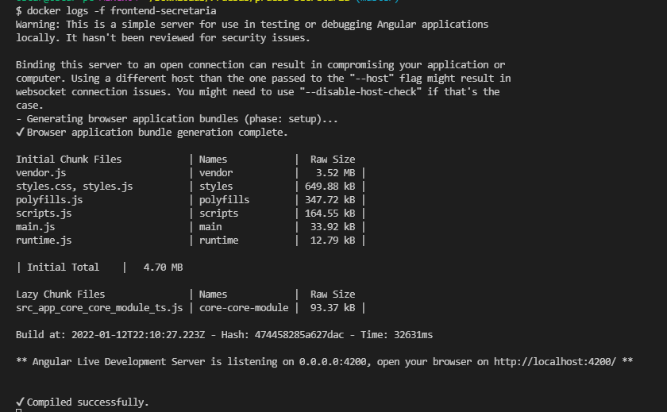

# <b>Secretaria</b>

Proyecto desarrollado para el manejo de un inventario de productos

## <b>Tecnologias utilizadas</b>

### <b>Front-end</b>

Angular 13

### <b>back-end</b>

Python 3.9 con django framework

### <b>Base de datos</b>

SQL Server

### <b>Despliegue</b>

Docker 
Docker-compose

## <b>Instalaciones necesarias para el ambiente local</b>

angular cli version 13.1.2  
python 3.9 
docker 20.10.10 
docker-compose 1.29.2 

## <b>Descarga de codigo fuente y instalacion local</b>

Se debe clonar el repositorio para la descaga del codigo fuente del proyecto con el siguiente comando `git clone https://github.com/Abaddon25/prueba-secretaria.git`,  

Una vez descargado el codigo fuente se debe ingresar a la carpeta que se descargo y se debe seguir los siguentes pasos para la puesta en marcha del proyecto:  

### <b>Front-end</b>

Se debe ingresar a la carpeta frontend por linea de comandos `cd frontend2` desde la raiz de la carpeta descargada. 
Dentro de la carpeta del front end se debe correr el comando `npm install`.  

### <b>Back-end</b>

Se debe ingresar a la carpeta backend por linea de comandos `cd backend` desde la raiz de la carpeta descargada. 
Se debe crear el ambiente virtual para el proyecto de back end con el siguiente comando `virtualenv env`.  
Una vez creada el ambiente se debe correr el siguiente comando para la instalacion de las dependencias del proyecto `pip install -r requirements.txt`.  

### <b>Despliegue y cargue del ambiente de desarrollo</b>

Nota: Este ambiente esta configurado para que actualice y vuelva a cargar los ultimos cambios realizados. 

Para el despliegue del ambiente de desarrollo se debe correr el siguente comando para la creacion de los docker tanto front, back y base de datos:
`docker-compose --env-file docker.config.env.dev up -d --build`

#### <b>Esto se debe solo realizar la primera vez despues de descargar el repo</b>
En windows nos saldra una alerta de permisos sobre las carpetas del proyecto a medida que va cargando la instancia, se debe aceptar todas las solicitudes.

Una vez subido el ambiente se debe conectarse al docker de mssql con el siguiente comando `docker exec -it mssql /bin/sh` una vez a al interior del contenedor debe correr el siguiente comando  `entrypoint.sh`. 

Debemos subir y bajar el ambiente para que tome los cambiso realizados sobre la base de datos con los siguientes comandos
`docker-compose --env-file docker.config.env.dev down`
`docker-compose --env-file docker.config.env.dev up -d --build`

## <b>Revision despliegue</b>

Para el monitoreo del despliegue se puede ejecutar los siguientes comandos 
## Visual correctamente proyecto desplegado 
docker logs backend-secretaria 

docker logs frontend-secretaria 

docker logs mssql 

